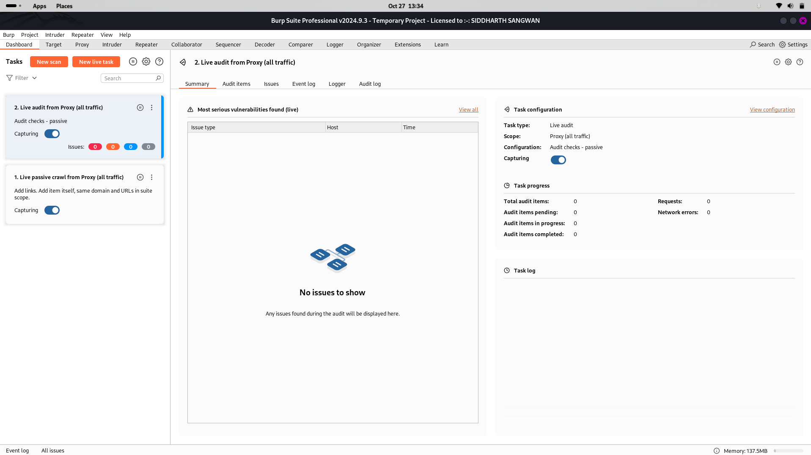
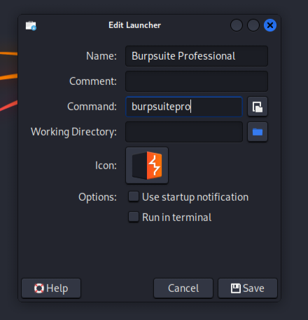
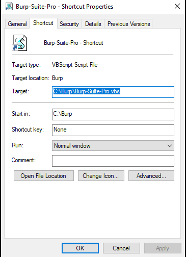

# burpsuit-pro
## burpsuit premium

# <h1 align="center"> Burpsuite Professional v2024 latest </h1>

 Burp Suite Professional is the web security tester's toolkit of choice. Use it to automate repetitive testing tasks - then dig deeper with its expert-designed manual and semi-automated security testing tools. Burp Suite Professional can help you to test for OWASP Top 10 vulnerabilities - as well as the very latest hacking techniques. Advanced manual and automated features empower users to find lurking vulnerabilities more quickly. Burp Suite is designed and used by the industry's best.

<h1 align="center">

[Overview](https://portswigger.net/burp/pro)
 </h1>
 
  

<h1 align="center"> Linux Installation </h1>

  

- ### Java Version [ stable: openjdk-21-jre ] 

      sudo update-alternatives --config java
                                           
- ### Auto Install

      curl https://github.com/huckbyte/burpsuit-pro/blob/main/install.sh | sudo sh

- ### Run

      burpsuitepro

- ### Update [Optional]

      cd
   
   
      curl https://github.com/huckbyte/burpsuit-pro/blob/main/update.sh | sudo sh
  

Note: Copy the license from loader to the burpsuite > manual activation > copy burpsuite request key to loader request >  copy response key to the burpsuite.

- ### Create a Launcher

     right click the desktop -> create a launcher name it Burpsuite Professional, add command `burpsuitepro` and select burpsuite community icon.

        
# <h1 align="center"> Windows Installation: </h1>

 
 
- Make a `Burp` directory name in `C Drive` for faster access.

- Download [install.ps1](https://github.com/huckbyte/burpsuit-pro/blob/main/install.ps1) and extract move the file inside to `C:\Burp`

- Open `Powershell` as administrator and execute below command to set Script Execution Policy.

      Set-ExecutionPolicy -ExecutionPolicy bypass -Scope process

- Inside PowerShell go to `cd C:\Burp`

- Now Execute `install.ps1` file in Powershell to Complete Installation.

      ./install.ps1
 
- Change the icon of `Burp-Suite-Pro.vbs` to the given icon 

- Create a shortcut to Desktop. Right Click over `Burp-Suite-Pro.vbs` Go to Shortcut tab, and below there is `Change Icon` tab

- Click there and choose the `burp-suite.ico` from `C:\Burp\`

   

- For Start Menu Entry, copy `Burp-Suite-Pro.vbs` file to 

      C:\ProgramData\Microsoft\Windows\Start Menu\Programs\

<h1 align="center" >
 
 

Credits:

* Loader.jar 👉 [Original](https://github.com/h3110w0r1d-y/BurpLoaderKeygen)
* Modified 👉 [Reviced](https://github.com/huckbyte/burpsuit-pro)

</h1>